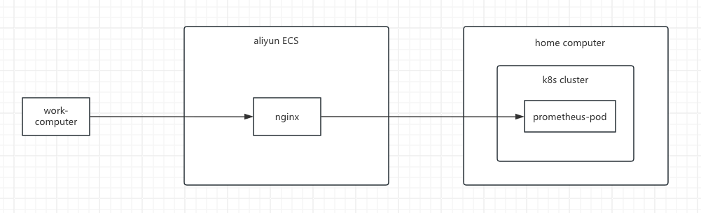

# install prometheus manual in k8s

## 准备 yaml 资源
参考 deploy/example
## 安装 yaml 资源
安装如下顺序执行：
```bash
kubectl apply -f prometheus-cm.yaml
kubectl apply -f prometheus-volume.yaml
kubectl apply -f prometheus-rbac.yaml
kubectl apply -f prometheus-deploy.yaml
```
## 外网访问 prometheus
外网访问方案：
